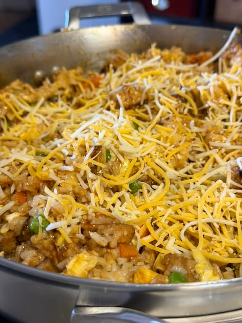

+++
title = 'Honey Garlic BBQ Chicken Fried Rice'
date = 2025-09-21T14:04:08-05:00
draft = false
tags = ["Chicken", "Dinner"]
prep_time = "30 mins"
cook_time = "21–24 mins"
+++

## Macros Per Serving (4 Total)
With Eggs: 520 Calories | 37g Protein | 52g Carbs | 18g Fat
With Broth (No Egg): 505 Calories | 36g Protein | 54g Carbs | 17g Fat

## Ingredients (4 Servings)

## For the Chicken:
- 680 g boneless skinless chicken thighs (or breasts if preferred)
- 80 g gluten-free BBQ sauce (about 1/3 cup)
- 40 g honey (about 2 tbsp)
- 3 cloves garlic, minced
- 15 g olive oil (1 tbsp)
- 1 tsp smoked paprika
- 1 tsp onion powder
- 1/2 tsp salt
- 1/2 tsp black pepper
- 110 g shredded sharp cheddar cheese (about 1 cup)

## For the Fried Rice (Choose Your Option):
## Base Ingredients:
- 600 g cooked day-old rice (about 3 cups, see note for broth option)
- 150 g frozen peas and carrots
- 80 g diced onion
- 2 scallions, chopped (greens separated)
- 20–30 g tamari (1 ½–2 tbsp, gluten-free soy sauce, adjust to taste)
- 5 g sesame oil (1 tsp)
- 15 g avocado or canola oil (1 tbsp)
- 1/4 tsp white pepper

## Option 1 — With Eggs:
2 eggs, lightly beaten

## Option 2 — With Broth (No Egg):
200 g uncooked jasmine or basmati rice (about 1 cup dry)
480 ml chicken broth (gluten-free)
5 g butter (1 tsp, optional for richness)

### Steps:
1.	Prepare Rice
  - Egg Option: Cook rice in water as usual, chill at least 1 hour or overnight
  - Broth Option: Cook rice in chicken broth instead of water (200 g rice + 480 ml broth). Chill at least 1 hour or overnight.

2.	Marinate the Chicken: Mix BBQ sauce, honey, garlic, olive oil, smoked paprika, onion powder, salt, and pepper. Toss chicken to coat. Marinate 30 minutes (overnight best).

3.	Cook the Chicken: Heat skillet or grill pan on medium-high. Cook 5–6 minutes per side until charred and internal temp reaches 74°C / 165°F.

4.	Cheddar Finish: Sprinkle cheddar over hot chicken, cover pan for 1–2 minutes until melted. Remove from heat and rest.

5.	Fried Rice: Heat avocado oil in a wok or skillet over high. Add onion and scallion whites, stir-fry 1–2 minutes.
•	If Using Eggs: Push aromatics aside, scramble eggs until just set.
•	If Using Broth Rice: Skip eggs, add a touch of butter later for richness.
6.	Add peas and carrots. Stir-fry 2 minutes.
7.	Add chilled rice, breaking up clumps. Stir-fry until hot and lightly crisped.
8.	Season with tamari, sesame oil, white pepper. Toss well. Stir in scallion greens at the end. If using broth rice, finish with butter.

### Serve:
Divide fried rice into 4 containers. Slice cheesy BBQ chicken and place on top or beside rice.