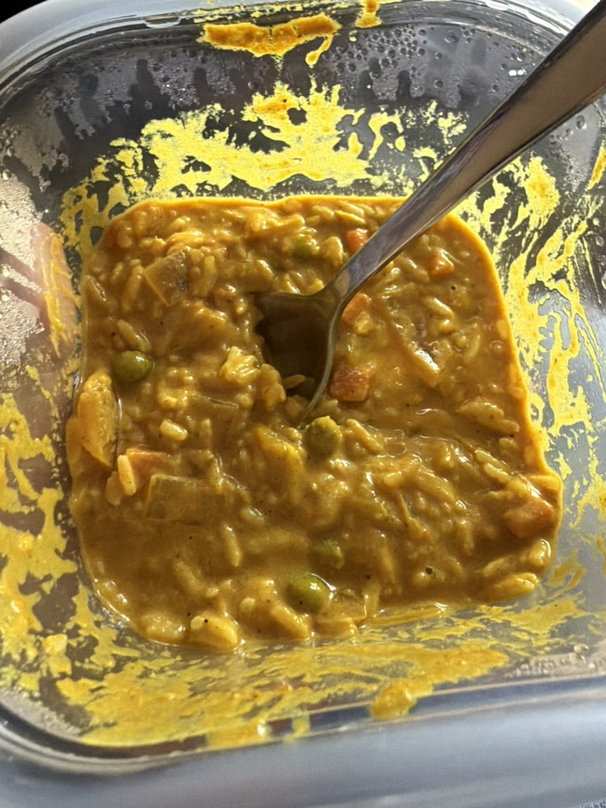

+++
title = 'Slow Cooker Korma'
date = 2026-01-07T17:53:57-05:00
draft = true
description = ""
tags = ["Indian", "Chicken", "Dinner"]
servings = "4"
prep_time = ""
cook_time = ""
difficulty = "1"
+++

## Macros Per Serving (4 Total)
## 430 Calories | 33g Protein | 24g Carbs | 23g Fat

    

## Ingredients:
- 1.5 lbs chicken breast, cut into large chunks
- 1 medium onion, diced
- 3 cloves garlic, minced
- 1 tbsp grated ginger
- 1 cup unsweetened coconut milk
- 0.5 cup plain Greek yogurt
- 0.5 cup tomato sauce
- 2 tbsp almond butter
- 1 tbsp curry powder
- 1 tsp garam masala
- 1 tsp turmeric
- 1 tsp salt
- 0.25 tsp cayenne (optional)
- 1 cup diced potatoes (or cauliflower for lower carbs)
- 0.5 cup frozen peas
- 1 tbsp lemon juice
- Fresh cilantro for topping

## Steps:
1. Add onions, garlic, ginger, spices, tomato sauce, coconut milk, yogurt, and almond butter into the crockpot and whisk.
2. Add chicken and potatoes (or cauliflower). Stir to coat.
3. Cook on LOW 6–7 hours or HIGH 3–4 hours.
4. Stir in peas and lemon juice during the last 10 minutes.
5. Portion into 4 containers and top with cilantro.